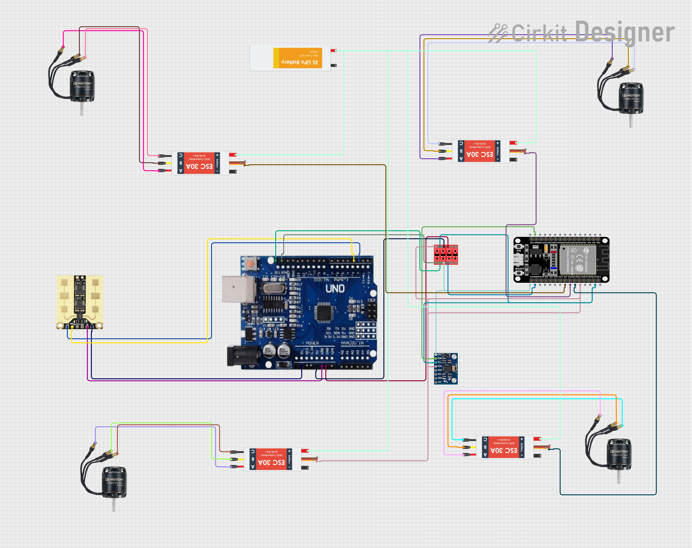

# Search & Rescue (S&R) Radar System 📡

[](https://opensource.org/licenses/Apache-2.0)

A complete Search & Rescue drone system using an Arduino, ESP32, mmWave radar, and MPU6050 to detect the presence of humans in disaster scenarios. The system features a real-time Python visualization, audio alerts, and autonomous flight capabilities.

The goal of this project is to create a fully functional drone platform that can help first responders quickly locate individuals trapped under rubble after an earthquake or other structural collapse.

---

## 🎯 Key Features

* **Human Detection:** Uses a DFRobot C4001 mmWave radar to detect human presence, even through obstacles.
* **Autonomous Flight:** Complete quadcopter system with 4x T-MOTOR AT2820 KV1250 motors and ESC control.
* **Dual Controller Architecture:** Arduino for primary flight control, ESP32 for advanced features and relay control.
* **Real-time Visualization:** A Python-based GUI displays target location on a polar plot and signal energy on a range profile graph.
* **Orientation Sensing:** An MPU6050 provides orientation data for flight stability and 3D mapping.
* **Audio Alerts:** The system uses text-to-speech to announce when a person is detected, providing their distance and signal strength.
* **Expandable Control:** 4-channel relay module for additional payload control and sensor integration.
* **High-Power System:** 3S LiPo battery (30C 3000mAh) for extended flight time and high-power operations.

---

## 🛠️ Hardware & Software Requirements

### Hardware Components
* **Primary Controller:** Arduino Uno
* **Secondary Controller:** ESP32-WROOM-32 Module
* **Primary Sensor:** DFRobot C4001 mmWave Radar Sensor
* **Orientation Sensor:** MPU6050 6-Axis Gyroscope & Accelerometer
* **Control System:** 4-Channel Relay Module
* **Motor System:** 4x ESC 30A BLDC Controllers
* **Propulsion:** 4x T-MOTOR AT2820 KV1250 Brushless Motors
* **Power:** 3S LiPo Battery (30C 3000mAh)
* **Frame:** Quadcopter frame (not shown in diagram)
* **Wiring:** Jumper wires, connectors, and power distribution board

### Software & Libraries
* [Arduino IDE](https://www.arduino.cc/en/software)
* Python 3.x
* **Arduino Libraries:**
    * `DFRobot_C4001` (Note: This may be needed on the ESP32 side, or on the Arduino if it's processing raw data)
    * `MPU6050_tockn`
    * `Wire`
    * `SoftwareSerial` (for Arduino-ESP32 communication)
* **Python Libraries:**
    * `pyserial`
    * `matplotlib`
    * `numpy`
    * `pyttsx3`

---

## 🚀 Getting Started

Follow these steps to get the project running on your own hardware.

### 1. Hardware Setup

1.  **Wire the Components:** Following the circuit diagram, connect the sensors to their respective controllers.
    * **MPU6050 Sensor (to Arduino):**
        * `VCC` -> Arduino `5V`
        * `GND` -> Arduino `GND`
        * `SCL` -> Arduino `A5`
        * `SDA` -> Arduino `A4`
    * **C4001 Radar (to ESP32):**
        * Connect the radar's `VCC`, `GND`, `TX`, and `RX` pins to the ESP32 (as shown in the diagram).
    * **Relay Module (to ESP32):**
        * Connect the relay's control pins to available GPIOs on the ESP32.
    * **Controller Communication (Arduino <-> ESP32):**
        * Connect Arduino pins `2, 3, 4, 5` to corresponding GPIO pins on the ESP32 to establish a communication link.

2.  **Complete Circuit Diagram:** This system includes a full quadcopter platform with dual controllers, motor control, and advanced sensing capabilities.

    
    
    *Complete electrical schematic showing all components and connections for the Search & Rescue drone system*

    **Key System Components:**
    -   **Arduino UNO:** Primary flight controller and sensor hub
    -   **ESP32-WROOM-32:** Secondary controller for advanced features
    -   **4x ESC 30A BLDC Controllers:** Motor speed control
    -   **4x T-MOTOR AT2820 KV1250 Motors:** Brushless propulsion
    -   **3S LiPo Battery (30C 3000mAh):** High-power energy source
    -   **4-Channel Relay Module:** Expandable control system

    **Main Connections:**
    -   **Arduino I2C:** A4/A5 → MPU6050 (orientation sensing)
    -   **Arduino Motor Control:** Pins 6,7,10,11 → ESC signal lines
    -   **Arduino-ESP32 Link:** Arduino Pins 2,3,4,5 → ESP32 GPIOs
    -   **ESP32 Sensors:** ESP32 GPIOs → C4001 Radar (human detection)
    -   **ESP32 Control:** ESP32 GPIOs → 4-Channel Relay Module
    -   **Power Distribution:** 3S LiPo → ESCs → Motors

    For the complete detailed wiring diagram and connection specifications, see [`circuit_diagram.txt`](circuit_diagram.txt) in the repository root.

### 2. Software Installation

1.  **Clone the Repository:**
    ```bash
    git clone [https://github.com/PrimalSky0019/Search-And-Rescue-Drone.git](https://github.com/PrimalSky0019/Search-And-Rescue-Drone.git)
    cd Search-And-Rescue-Drone
    ```

2.  **Install Python Dependencies:**
    ```bash
    pip install pyserial matplotlib numpy pyttsx3
    ```

3.  **Upload Arduino Code:**
    * Open `arduinocode.ino` in the Arduino IDE.
    * Install the required libraries from the Library Manager.
    * Select your board and COM port.
    * Click "Upload".
    *(Note: You will also need to program the ESP32 with code to read the radar and send data to the Arduino. This file is not listed in the README but is implied by the diagram.)*

### 3. Running the System

1.  **Configure the COM Port:** Find your **Arduino's** serial port name (e.g., `COM4` on Windows or `/dev/ttyUSB0` on Linux).
2.  **Update the Python Script:** Open `sensor_output.py` and change the `SERIAL_PORT` variable to your port name.
    ```python
    # sensor_output.py
    SERIAL_PORT = 'COM4' # <-- CHANGE THIS
    ```
3.  **Launch the Visualizer:** Run the script from your terminal.
    ```bash
    python sensor_output.py
    ```
    A plot window should appear, and the system will start scanning for targets.

---

## 📊 Demo

Here is a sample of the Python visualization in action. The left plot shows the detected person's location (distance and angle), and the right plot shows the energy of the returned signal.

*(**This is the most important part!** Record a short GIF of your screen when the program is running and detecting you. You can use a free tool like [ScreenToGif](https://www.screentogif.com/) or GIPHY Capture. Then, just drag and drop the GIF file into the README editor on GitHub.)*

[Animation of the matplotlib plots detecting a person]

---

## 💡 How It Works

The system operates using a dual-controller architecture:

1.  **ESP32 Sensor Hub:** The ESP32 is dedicated to handling complex sensors. It continuously polls the C4001 mmWave radar for target data and also controls the 4-channel relay module.
2.  **Arduino Flight & Comms Hub:** The Arduino serves as the primary flight controller and data aggregator. It continuously polls the MPU6050 for orientation data and controls the four ESCs for flight stability. It also receives the processed radar data from the ESP32 (via the 4-pin connection).
3.  **Data Transmission:** The Arduino packages its own MPU data and the radar data from the ESP32 into a simple comma-separated string (e.g., `1,5.2,850,0.5,-1.2,89.5`). It sends this string over its main USB serial port to the host computer. If no target is found, it sends a `0`.
4.  **Python Visualization Client:** A Python script on the host computer listens to the Arduino's serial port. It runs two main threads:
    * **Serial Reader Thread:** Constantly reads data from the Arduino so the main application never freezes.
    * **Main Thread:** Parses the incoming data and uses Matplotlib to update the plots in real-time. If a new target is detected, it triggers a text-to-speech alert in a separate thread to avoid interrupting the visualization.

---

## 🗺️ Roadmap & Future Improvements

This is an early-stage prototype. Future enhancements could include:
* [ ] Integrating with a drone's flight controller (e.g., MAVLink).
* [ ] Creating a 3D map of detections instead of a 2D plot.
* [ ] Using a more robust GUI framework like PyQt or Tkinter.
* [ ] Implementing a logging system to save detection data.

Contributions and ideas are welcome!
